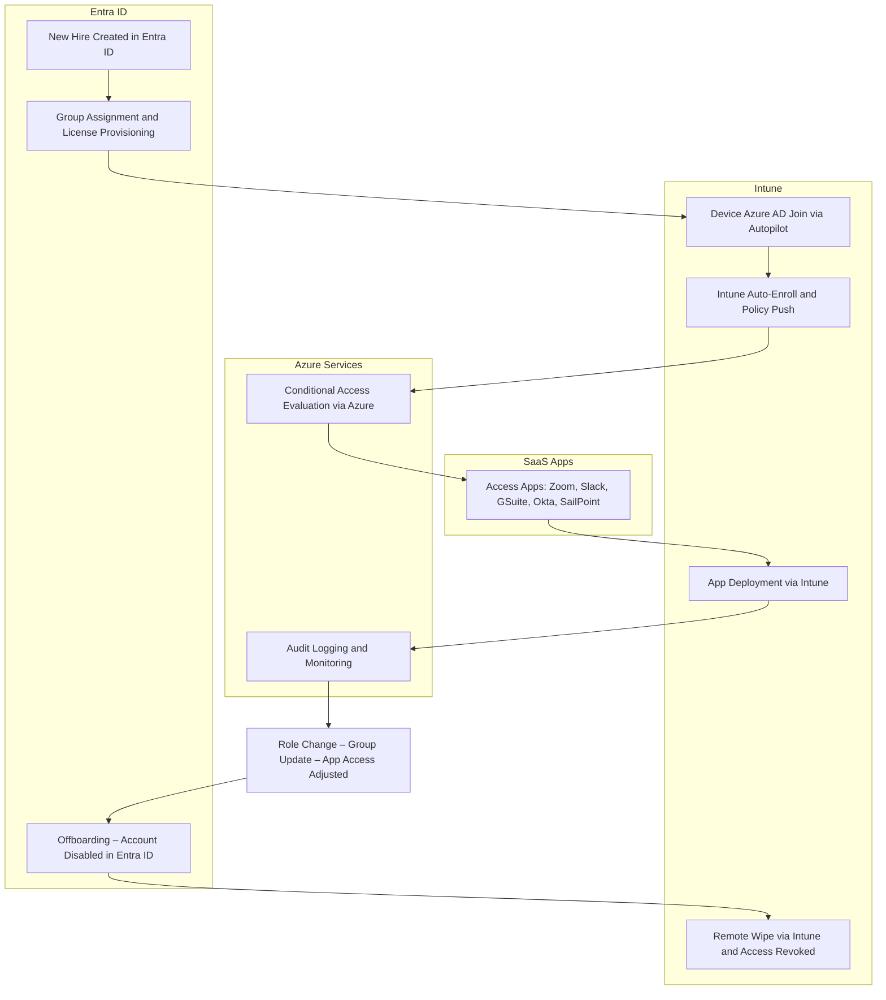

# 🧭 How Microsoft Intune and Entra ID Work Together: A-Z User Lifecycle Example
This guide breaks down how Microsoft **Entra ID** (identity and access control) and **Microsoft Intune** (device and app management) work together to support an employee throughout their entire lifecycle—from onboarding to offboarding.

---

## Meet Amir – New Hire at XYZ Ltd.

Let’s walk through his journey from Day 1 to Exit, powered by Entra ID + Intune automation.

---

## 1. Joiner Phase – New User Onboarding

| Step | Entra ID | Intune |
|------|----------|--------|
| **User Creation** | Account auto-created via HR system or manually in Entra ID | N/A |
| **Group Assignment** | Added to security groups (e.g., "Sales Team") | Triggers Intune app/policy assignments |
| **License Assignment** | M365 & Intune licenses via group-based licensing | Enables enrollment in Intune |
| **MFA & Conditional Access** | Enforces secure login policies (e.g., MFA, location-based access) | Ensures only compliant devices connect |
| **Welcome Workflow** | Sends login credentials & temporary access pass | N/A |

---

## 2. Device Enrollment & Configuration

| Step | Entra ID | Intune |
|------|----------|--------|
| **Device Join** | Device Azure AD Joined (Autopilot or manual) | Auto-enrolled into Intune (MDM) |
| **Policy Enforcement** | N/A | Deploys security policies, device restrictions, compliance rules |
| **App Deployment** | N/A | Pushes required apps (Teams, Outlook, LOB apps) |
| **Compliance Monitoring** | N/A | Tracks device health, patch status, and encryption |

---

## 3. App Access Request – Office 365 or Adobe Licensing

### Scenario: User Requests Access to Microsoft 365 or Adobe

| Step | Entra ID | Intune |
|------|----------|--------|
| **App Request Workflow** | User submits request via internal portal or Self-Service | N/A |
| **Group Membership** | Approved users are added to relevant group (e.g., `O365-License`, `Adobe-Entitlement`) | Group triggers app assignment |
| **License Assignment** | Entra ID applies license via group-based licensing rules | Activates product entitlement (e.g., M365 E3 or Adobe Creative Cloud) |
| **App Installation** | N/A | Intune pushes app package to user device (Office Apps or Adobe Installer via Win32 deployment) |
| **Activation** | User logs in with Entra ID credentials | App activates using assigned license |

> **Example:**  
> Amir requests Adobe Illustrator access → Approved → Added to `Adobe-Creative-Team` group → License is auto-assigned → Intune installs the app silently → Ready to use upon next login.

---

## 4. Mover Phase – Role or Department Change

| Scenario | Entra ID | Intune |
|----------|----------|--------|
| **Role Change** | Updated group membership changes access to apps/files | Deploys new app set & updates policies |
| **Privileged Access** | Uses PIM for elevated access | N/A |
| **Access Reviews** | Periodic group membership & access audits | N/A |
| **Device Monitoring** | N/A | Ensures the device remains compliant |

---

## 5. Leaver Phase – Offboarding

| Step | Entra ID | Intune |
|------|----------|--------|
| **Account Disablement** | Auto-disabled via HRMS sync or manual removal | N/A |
| **Access Revocation** | Group/role removal → loss of access | Compliance policy blocks device |
| **Remote Actions** | N/A | Remote wipe or selective wipe for BYOD |
| **Audit Logging** | Logs identity/access changes | Records device actions and status |

---

## Why Entra ID + Intune Are Better Together

- **Zero-touch provisioning** with Autopilot + Entra join
- **Secured identity** with conditional access & MFA
- **Centralized policy & app deployment**
- **Automated role transitions & offboarding**
- **Audit-ready for compliance**

> **Tagline:** One identity. One device. Total control.

---

## 👤 Centralized User Creation in Entra ID: Unlocking Access & Automation

Creating a user in **Microsoft Entra ID** triggers a cascade of access provisioning across your identity, device, and application landscape. This central identity becomes the backbone of secure onboarding, app access, and device compliance.

---

### What Happens When You Create a User in Entra ID

| Stage | Action | Result |
|-------|--------|--------|
| **Identity Setup** | User account created in Entra ID | Centralized identity object is registered |
| **Group Assignment** | Assigned to security groups (`SlackUsers`, `ZoomLicensed`, etc.) | Triggers license provisioning and app access |
| **SCIM Provisioning** | Entra ID syncs user to SaaS apps via SCIM (Zoom, Slack, GSuite, SailPoint) | Accounts are automatically created and updated |
| **SSO Enablement** | Apps configured for SAML/OIDC with Entra ID as IdP | User logs into apps seamlessly using one identity |
| **Device Enrollment (Optional)** | Device is Azure AD Joined | Intune auto-enrolls and pushes compliance policies |
| **Conditional Access** | Azure evaluates risk and device compliance | Access allowed only from trusted devices |
| **Audit & Governance** | Access logs captured in Azure Monitor | Ensures compliance and lifecycle tracking |

---

### Example Flow

> 👤 Amir is created in Entra ID  
> – Assigned to `Marketing-GSuite`, `SlackUsers`, `ZoomLicensed` groups  
> – GSuite account provisioned → Gmail, Drive, Calendar activated  
> – Slack and Zoom accounts created → Apps deployed to device via Intune  
> – Device joins Azure AD → Intune applies security policies  
> – Entra ID enables SSO → user logs in without separate credentials  
> – Azure enforces Conditional Access → access gated by risk and device trust  
> – Logs captured for audit → SailPoint monitors access lifecycle

---

> **Tagline:** One identity. Automated provisioning. Trusted access — powered by Entra ID at the center.

## Identity & App Lifecycle Flow: Entra ID + Intune + Azure + SaaS Apps

---

## ☁️ Azure's Role in Endpoint & Identity Lifecycle
While Microsoft **Intune** handles device management and **Entra ID** governs identity, **Azure** is the cloud engine powering everything behind the scenes. It enables automation, scalability, and security throughout the user lifecycle.

---

### Key Responsibilities of Azure

| Feature | Description |
|--------|-------------|
| **Azure AD Join** | Devices join Entra ID through Azure, enabling automatic Intune enrollment |
| **MDM Auto-Enrollment** | Azure defines MDM scopes to ensure seamless onboarding into Intune |
| **Conditional Access Enforcement** | Evaluates Entra ID signals + Intune compliance before granting access |
| **Privileged Identity Management (PIM)** | Allows secure, just-in-time elevation for admin roles with audit logs |
| **Role-Based Access Control (RBAC)** | Assigns granular permissions across Intune and Entra ID workloads |
| **Audit Logging & Monitoring** | Tracks device actions, access changes, and identity updates for compliance |
| **Infrastructure Resilience** | Azure ensures global availability, scalability, and security posture |
| **Azure App Proxy** | Provides secure access to internal apps without VPN dependency |

---

### Example: Device Setup via Azure

> - Amir receives a laptop  
> - Signs in → Azure AD Join (via Entra ID)  
> - Device auto-enrolled into Intune  
> - Azure evaluates compliance signals and applies Conditional Access  
> - RBAC and PIM used by IT for admin tasks  
> - Azure logs all activities for audit  

---

> **Tagline:** Azure is the glue—connecting identities, devices, and policies with global cloud power.

## Access Management with Entra ID + Intune

Managing who gets access to **what**, **when**, and **how** is critical to maintaining a secure IT environment. Here's how access management is handled seamlessly using Entra ID and Intune.

| Component | Entra ID Role | Intune Role |
|-----------|---------------|-------------|
| **Group-Based Access** | Manages access to M365, SaaS apps, files, and systems via security group membership | Deploys apps and config policies based on group membership |
| **Role-Based Access Control (RBAC)** | Grants admin roles (e.g., User Admin, Security Admin) based on least privilege | Assigns scoped admin access to manage specific devices or workloads |
| **Conditional Access (CA)** | Enforces access based on conditions like device state, location, risk level, compliance | Blocks/Allows access only from compliant, managed devices |
| **Privileged Identity Management (PIM)** | Provides just-in-time access to high-privilege roles with audit trails | N/A |
| **Self-Service Access (SSPR & Group Join)** | Users can request or join groups via access packages | Triggers app/license assignment and policy enforcement via group logic |

---

### Example: Secure App + Device Access

> - Amir joins the **Design Team**  
> - Added to `DesignTeam-O365` and `AdobeCloud-Users` groups  
> - Gains access to SharePoint, Teams, Photoshop, Illustrator, etc...
> - Conditional Access ensures her laptop is Intune-compliant before allowing access  
> - Office and Adobe apps are installed silently via Intune  
> - Amir requests temporary access to a Power BI report — approved through **PIM**  
> - Access expires automatically after 7 days

---

## 🏢 Enterprise Application Management with Entra ID, Azure & Intune

Managing enterprise applications in Microsoft Entra ID enables secure onboarding, access control, provisioning, and governance for both cloud and on-prem apps.

---

### 📦 What Are Enterprise Applications?

- ✅ Pre-integrated SaaS apps from the Microsoft Entra gallery (Zoom, Slack, Salesforce, etc.)
- 🧩 Custom-developed or third-party apps using SAML/OIDC
- 🏠 On-prem apps exposed externally via Azure App Proxy
- 🎭 Every app gets a **Service Principal** object in Entra ID to control access and permissions

---

### ⚙️ Key Management Capabilities

| Capability | Description |
|------------|-------------|
| **SSO Configuration** | Enable SAML/OIDC-based authentication for seamless login |
| **Group Assignment** | Control who can access apps via dynamic or static security groups |
| **SCIM Provisioning** | Automate user creation, license assignment, and deprovisioning |
| **Conditional Access** | Enforce access rules based on location, device state, risk level |
| **App Proxy** | Publish internal apps securely to remote users (no VPN required) |
| **App Branding & Portal Visibility** | Customize app name, logo, and user access experience |
| **Audit Logging** | Track app sign-ins, group changes, and access reviews |
| **Admin Consent Workflow** | Manage app permissions before allowing tenant-wide integration |

---

### 🔁 Lifecycle Flow Example: Salesforce Access Request

> 🧑‍💼 Amir requests access to Salesforce  
> – Added to `SalesTeam-SFDC` security group via Entra ID  
> – Group triggers license provisioning via SCIM  
> – Device compliance checked by Intune  
> – Azure enforces Conditional Access policies  
> – App becomes available in MyApps portal with SSO enabled  
> – Admins monitor activity via Azure Audit Logs

---

### 🧠 Bonus Concepts

| Term | Meaning |
|------|--------|
| **App Registration** | Technical definition of app identity and permissions |
| **Enterprise Application** | Actual deployed instance for user access control |
| **Service Principal** | Identity object used to manage app permissions and access |
| **RBAC** | Role-Based Access Control to delegate admin permissions securely |

---

> **Tagline:** One portal. One policy engine. Secure access to every app in your digital ecosystem.

## 🔗 Okta Integration with Entra ID, Azure & Intune

Using **Okta** as your SSO provider complements the identity and device security offered by **Microsoft Entra ID**, **Azure**, and **Intune**. Here's how they work together across the user journey:

---

### 🧠 Federation & SSO Workflow

| Component | Role in Integration | Notes |
|----------|----------------------|-------|
| **Okta** | Acts as Service Provider (SP) or Identity Provider (IdP) | Handles SSO authentication and app portal |
| **Entra ID** | Can federate with Okta using SAML or OIDC | Provides secure identity governance |
| **Azure** | Evaluates device compliance and access risk signals | Powers Conditional Access and logs |
| **Intune** | Ensures device compliance before Okta SSO is allowed | Pushes apps and enforces policies |

---

### 🔁 Example: Logging into Slack via Okta

> ✅ Amir signs into his company laptop  
> – Device is **Azure AD-joined** and **Intune-compliant**  
> – Entra ID authenticates Amir → Okta grants Slack access via SAML  
> – Azure evaluates compliance and location signals  
> – Slack opens, governed by group membership and Conditional Access  

---

### 📦 Provisioning & Governance Benefits

- Okta supports **group-based access**, SCIM provisioning, and custom login workflows  
- Entra ID governs identity lifecycle and syncs with HR systems  
- Intune ensures that only compliant devices access federated apps  
- Azure provides audit logging, RBAC, and security insights across platforms

---

> **Tagline:** Okta for access, Entra ID for governance, Intune for compliance — unified security across your digital workspace.

## 🔗 Zoom Integration with Entra ID, Azure & Intune

Zoom works seamlessly with Microsoft’s identity and device management stack to provide secure access, automated provisioning, and compliance enforcement.

---

### 🧠 Identity & SSO Integration (Entra ID)

| Component | Role |
|----------|------|
| **Microsoft Entra ID** | Acts as the Identity Provider (IdP) using **SAML 2.0** |
| **Zoom** | Configured as a Service Provider (SP) for SSO |
| **Group-Based Access** | Entra ID assigns Zoom licenses based on group membership |
| **SCIM Provisioning** | Automatically creates and updates Zoom user accounts from Entra ID |

> ✅ Add Zoom from the [Microsoft Entra application gallery](https://learn.microsoft.com/en-us/entra/identity/saas-apps/zoom-tutorial)  
> ✅ Configure SAML SSO with your Zoom vanity URL  
> ✅ Map user attributes and enable auto-provisioning

---

### ☁️ Azure’s Role

| Feature | Description |
|--------|-------------|
| **Conditional Access** | Evaluates device compliance and risk signals before Zoom login |
| **Audit Logging** | Tracks Zoom access and provisioning events |
| **Infrastructure Backbone** | Hosts Entra ID and supports secure authentication flows |

---

### 📱 Intune’s Role

| Feature | Description |
|--------|-------------|
| **Zoom for Intune App** | Available in Azure Marketplace for MAM scenarios |
| **App Deployment** | Deploy Zoom desktop client via MSI or Win32 package |
| **Compliance Enforcement** | Ensures only secure, compliant devices access Zoom |
| **Remote Actions** | Supports wipe, encryption, and policy enforcement for BYOD and corporate devices |

---

### 🔁 Example: Zoom Access Flow

> 💼 Amir logs into Zoom from his company laptop  
> – Device is **Azure AD-joined** and **Intune-compliant**  
> – Entra ID authenticates via **SAML SSO**  
> – Azure evaluates Conditional Access policies  
> – Zoom opens with full access, governed by group membership and provisioning rules

---

> **Tagline:** Zoom stays secure and compliant—thanks to Entra ID for identity, Azure for access control, and Intune for device trust.

## 🔗 Slack Integration with Entra ID, Azure & Intune

Slack works seamlessly with Microsoft’s identity and device management stack to deliver secure access, automated provisioning, and compliance enforcement.

---

### 🧠 Identity & SSO Integration (Entra ID)

| Component | Role |
|----------|------|
| **Microsoft Entra ID** | Acts as the Identity Provider (IdP) using **SAML 2.0** |
| **Slack** | Configured as a Service Provider (SP) for SSO |
| **Group-Based Access** | Entra ID assigns Slack access based on group membership |
| **SCIM Provisioning** | Automatically creates and updates Slack user accounts from Entra ID |

> ✅ Add Slack from the [Microsoft Entra application gallery](https://learn.microsoft.com/en-us/entra/identity/saas-apps/slack-tutorial)  
> ✅ Configure SAML SSO with your Slack workspace URL  
> ✅ Enable SCIM provisioning for automated user lifecycle management

---

### ☁️ Azure’s Role

| Feature | Description |
|--------|-------------|
| **Conditional Access** | Evaluates device compliance and risk signals before Slack login |
| **Audit Logging** | Tracks Slack access and provisioning events |
| **Infrastructure Backbone** | Hosts Entra ID and supports secure authentication flows |

---

### 📱 Intune’s Role

| Feature | Description |
|--------|-------------|
| **Slack for Intune App** | Available for MAM scenarios on iOS and Android |
| **App Deployment** | Deploy Slack desktop client via Microsoft Store, MSI, or Win32 |
| **Compliance Enforcement** | Ensures only secure, compliant devices access Slack |
| **App Protection Policies** | Restrict data sharing, downloads, and clipboard access on mobile devices |

---

### 🔁 Example: Slack Access Flow

> 💼 Amir logs into Slack from his company laptop  
> – Device is **Azure AD-joined** and **Intune-compliant**  
> – Entra ID authenticates via **SAML SSO**  
> – Azure evaluates Conditional Access policies  
> – Slack opens with full access, governed by group membership and provisioning rules

---

> **Tagline:** Slack stays secure and compliant—thanks to Entra ID for identity, Azure for access control, and Intune for device trust.

## 🔗 GSuite Integration with Entra ID, Azure & Intune

Google Workspace (formerly G Suite) can be securely integrated with Microsoft’s identity and device management stack to enable SSO, automated provisioning, and compliance enforcement.

---

### 🧠 Identity & SSO Integration (Entra ID)

| Component | Role |
|----------|------|
| **Microsoft Entra ID** | Acts as the Identity Provider (IdP) using **SAML 2.0** |
| **Google Workspace** | Configured as a Service Provider (SP) for SSO |
| **Group-Based Access** | Entra ID assigns access based on security group membership |
| **SCIM Provisioning** | Automatically creates and updates Google Workspace user accounts from Entra ID |

> ✅ Add **Google Cloud / G Suite Connector by Microsoft** from the [Microsoft Entra application gallery](https://learn.microsoft.com/en-us/entra/identity/saas-apps/google-apps-tutorial)  
> ✅ Configure SAML SSO with your domain-specific issuer and ACS URL  
> ✅ Enable SCIM provisioning for automated user lifecycle management

---

### ☁️ Azure’s Role

| Feature | Description |
|--------|-------------|
| **Conditional Access** | Evaluates device compliance and risk signals before Google Workspace login |
| **Audit Logging** | Tracks access and provisioning events across services |
| **Infrastructure Backbone** | Hosts Entra ID and supports secure authentication flows |

---

### 📱 Intune’s Role

| Feature | Description |
|--------|-------------|
| **App Deployment** | Deploy Google Workspace apps (e.g., Chrome, Drive) to managed devices |
| **Compliance Enforcement** | Ensures only secure, compliant devices access Google Workspace |
| **App Protection Policies** | Restrict data sharing and access on mobile devices |
| **Remote Actions** | Supports wipe, encryption, and policy enforcement for BYOD and corporate devices

---

### 🔁 Example: GSuite Access Flow

> 💼 Amir logs into Gmail from his company laptop  
> – Device is **Azure AD-joined** and **Intune-compliant**  
> – Entra ID authenticates via **SAML SSO**  
> – Azure evaluates Conditional Access policies  
> – Gmail opens with full access, governed by group membership and provisioning rules

---

> **Tagline:** GSuite stays secure and compliant—thanks to Entra ID for identity, Azure for access control, and Intune for device trust.

## 🔗 SailPoint IIQ Integration with Entra ID, Azure & Intune

SailPoint IdentityIQ (IIQ) provides robust identity governance and lifecycle management. When integrated with Microsoft’s cloud stack, it enables secure provisioning, access reviews, and compliance across hybrid environments.

---

### 🧠 Identity & Provisioning Integration (Entra ID)

| Component | Role |
|----------|------|
| **Microsoft Entra ID** | Acts as authoritative source for identity and group data |
| **SailPoint IIQ** | Aggregates identities and entitlements from Entra ID |
| **SCIM Provisioning** | Entra ID pushes user data to IIQ via SCIM API |
| **Lifecycle Management** | IIQ governs joiner/mover/leaver workflows using Entra ID data |

> ✅ Configure SCIM provisioning in Entra ID  
> ✅ Register SailPoint IIQ as an enterprise app  
> ✅ Map user attributes and enable automatic provisioning  
> ✅ Use SailPoint’s connector to manage Entra ID users, groups, and licenses

---

### ☁️ Azure’s Role

| Feature | Description |
|--------|-------------|
| **Conditional Access** | Evaluates device and identity signals before granting access |
| **Audit Logging** | Tracks provisioning and access events across services |
| **Infrastructure Backbone** | Hosts Entra ID and supports secure API communication |
| **Azure Management Objects** | IIQ can manage access to Azure resources via Entra ID connector |

---

### 📱 Intune’s Role

| Feature | Description |
|--------|-------------|
| **Device Compliance Signals** | Used by Entra ID to enforce Conditional Access policies |
| **Remote Actions** | Supports wipe and encryption for offboarding scenarios |
| **App Deployment** | Ensures SailPoint-related tools are available on managed devices |

---

### 🔁 Example: Identity Lifecycle with SailPoint IIQ

> 💼 Amir joins the company  
> – Entra ID creates user and assigns groups  
> – SCIM provisioning pushes user to SailPoint IIQ  
> – IIQ applies access policies and monitors entitlements  
> – Azure enforces Conditional Access based on IIQ signals  
> – Intune ensures device compliance before access is granted  
> – During offboarding, IIQ revokes access and triggers remote wipe via Intune

---

> **Tagline:** SailPoint IIQ + Microsoft Cloud = End-to-end identity governance with secure access and device trust.

